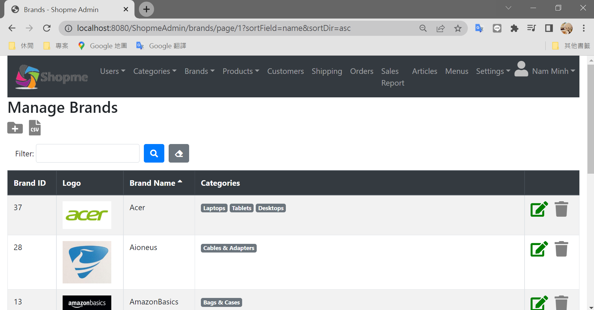
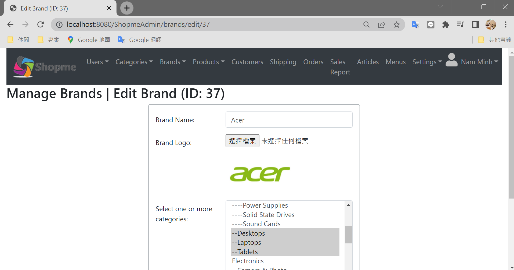
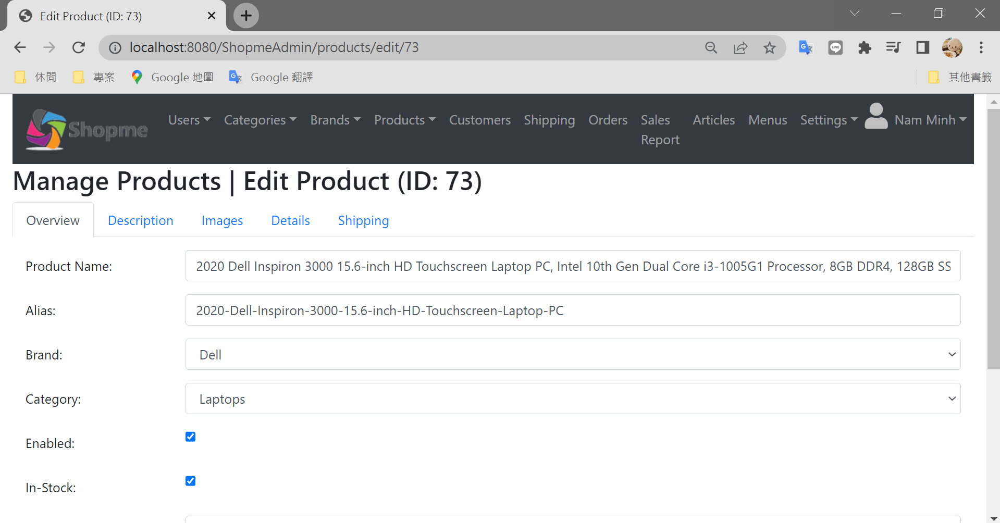
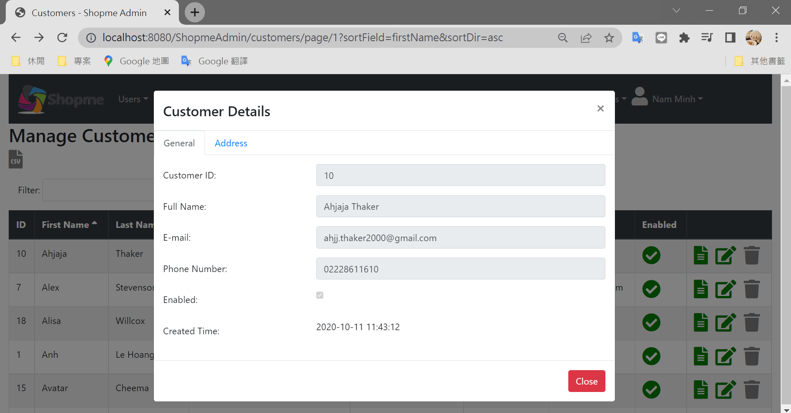

# SpringBootShopme
## 簡介
本篇參考Udemy課程 Spring Boot E-Commerce Ultimate Course(Nam Ha Minh)，所練習的購物車作品，使用JAVA語言，架構為Spring Boot，分為管理員管理後台以及使用者購物前台。
## 作品如下
###### 1-1. 前台-登入

###### 1-2. 前台-註冊

###### 1-3. 前台-分類

###### 1-4. 前台-商品

###### 1-5. 前台-商品內容

###### 1-6. 前台-購物車

###### 1-7. 前台-結帳

###### 1-8. 前台-PayPal

###### 1-9. 前台-PayPal信用卡

###### 2-1. 後台-登入

###### 2-1. 後台-使用者列表

###### 2-1. 後台-使用者編輯

###### 2-1. 後台-分類列表

###### 2-1. 後台-分類編輯

###### 2-1. 後台-品牌列表

###### 2-1. 後台-品牌編輯

###### 2-1. 後台-商品列表

###### 2-1. 後台-商品編輯

###### 2-1. 後台-商品內容

###### 2-1. 後台-前台使用者列表

###### 2-1. 後台-前台使用者編輯

###### 2-1. 後台-前台使用者內容

###### 2-1. 後台-前台訂單列表

###### 2-1. 後台-前台訂單內容

###### 2-1. 後台-前台訂單內容

###### 2-1. 後台-前台訂單內容

###### 2-1. 後台-前台訂單內容

###### 2-1. 後台-前台訂單編輯

###### 2-1. 後台-前台訂單編輯

###### 2-1. 後台-一般設定

###### 2-1. 後台-國家設定

###### 2-1. 後台-州設定

###### 2-1. 後台- mail server 設定

###### 2-1. 後台- mail 版型設定

## 參考
Udemy：Spring Boot E-Commerce Ultimate Course (Nam Ha Minh)
